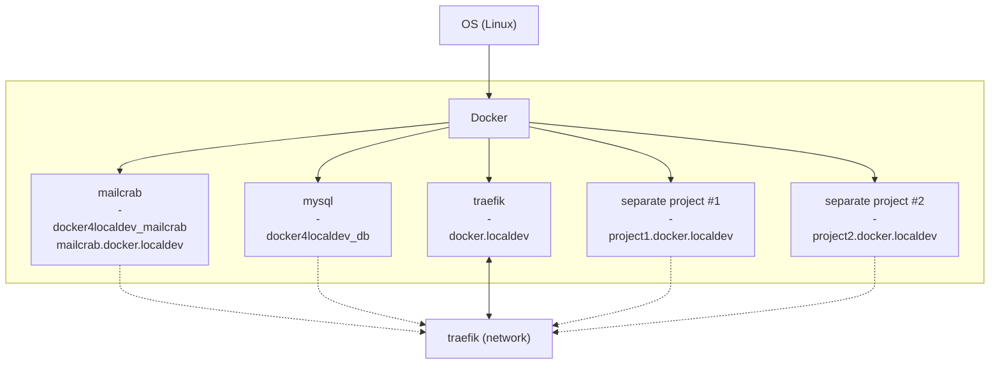

# Docker4LocalDev

Linux Docker Setup for Local Development

```
https://{YOUR_APP_1}.docker.localdev
https://{YOUR_APP_2}.docker.localdev
```



## Tested On

Tested on `Ubuntu 20.04`, `Ubuntu 22.04`, `Debian 12`, which use `NetworkManager` by default.
It has a `dnsmasq` plugin so we don't need to install a separate package.
I think it's safe to assume that you can apply the same principles to any Linux system.

Update: [Additional Instructions For `Ubuntu 24.04`](#ubuntu-2404)

## Default Containers

Check `docker-compose.yml`

- traefik
- mailcrab
- mysql/mariadb
    - you might not need this but I like to use just 1 instance of mysql server for all projects

## Getting Started

### 0. Configure `.env`

`cp .env.dist .env`
Then update the contents of `.env` especially if you're going to use mysql server

```
# mysql server
MYSQL_ROOT_PASSWORD=password
MYSQL_DATABASE=test_db
MYSQL_USER=normaluser
MYSQL_PASSWORD=12345

# or your favorite image from Docker hub
DB_SERVER_IMAGE=linuxserver/mariadb:10.5.13-alpine 
# mysql port you'll connect to
DB_EXTERNAL_PORT=3307
```

### 1. Generate your own _locally-trusted_ certificate.

Install `mkcert` on your system.
You can just download from the [releases](https://github.com/FiloSottile/mkcert/releases)
Then move it to your `/usr/local/bin/`
Once installed, run `mkcert -install`.
Then generate your self-signed certificates:

`mkcert -key-file ./certs/key.pem -cert-file ./certs/cert.pem localdev 'docker.localdev' '*.docker.localdev'`

Move the generated certificates (`cert.pem`, `key.pem`) to the folder `certs/`

### 2. Configure `dnsmasq` plugin to resolve localdev

Configure NetworkManager to use `dnsmasq` plugin:
`sudo nano /etc/NetworkManager/conf.d/00-use-dnsmasq.conf`

```conf
# Enables dnsmasq plugin.
[main]
dns=dnsmasq
```

Tell dnsmasq to resolve localdev as 127.0.0.1
`sudo nano /etc/NetworkManager/dnsmasq.d/00-resolve-localdev.conf`

```conf
# resolve *.localdev
address=/.localdev/127.0.0.1
```

### 3. Don't use /etc/resolv.conf

```
sudo mv /etc/resolv.conf /etc/resolv.conf.OLD
```

### 4. Restart Network

`sudo systemctl restart NetworkManager`

### 5. Test

You should get a response when you ping *.docker.localdev
Ex: `ping anythingyouwant.docker.localdev`

```bash
# should point to localhost
PING anythingyouwant.docker.localdev (127.0.0.1) 56(84) bytes of data.
64 bytes from localhost (127.0.0.1): icmp_seq=1 ttl=64 time=0.025 ms
64 bytes from localhost (127.0.0.1): icmp_seq=2 ttl=64 time=0.059 ms
64 bytes from localhost (127.0.0.1): icmp_seq=3 ttl=64 time=0.058 ms
```

### 6. Start/Reload project
`docker compose up -d`
You should be able to access [https://docker.localdev](https://docker.localdev) which is traefik web UI 

### 7. Configure your apps to use `traefik`

Ex. using compose file

```
# sample .env of your project
# PROJECT_NAME=app1
# PROJECT_URL=app1.docker.localdev
# TRAEFIK_SECURE_ENTRYPOINT=websecure
# TRAEFIK_NETWORK=traefik
    labels:
      - "traefik.enable=true"
      - "traefik.http.services.${PROJECT_NAME}_nginx.loadbalancer.server.port=80" # nginx uses port 80
      - "traefik.http.routers.${PROJECT_NAME}-nginx.rule=Host(`${PROJECT_URL}`)"
      - "traefik.http.routers.${PROJECT_NAME}-nginx.service=${PROJECT_NAME}_nginx"
      - "traefik.http.routers.${PROJECT_NAME}-nginx.entrypoints=${TRAEFIK_SECURE_ENTRYPOINT}"
      - 'traefik.http.routers.${PROJECT_NAME}-nginx.tls=true'
      - "traefik.docker.network=${TRAEFIK_NETWORK}"
```

after you reload your containers, you should be able to access its url. In this example: https://app1.docker.localdev

## Ubuntu 24.04
It seems our previous setup for `dnsmasq` plugin does not work anymore on Ubuntu 24.04 so we don't use that anymore and install `dnsmasq` separately. 
```bash
# install dnsmasq
sudo apt install dnsmasq -y

# remove config that enables dnsmasq plugin
sudo rm /etc/NetworkManager/conf.d/00-use-dnsmasq.conf

# remove dnsmasq plugin config file as well
sudo rm /etc/NetworkManager/dnsmasq.d/00-resolve-localdev.conf

# make sure we remove/move original resolv.conf
sudo rm /etc/resolv.conf

# create new resolv.conf with new contents
sudo bash -c 'echo "nameserver 127.0.0.1" > /etc/resolv.conf'
sudo bash -c 'echo "nameserver 8.8.8.8" >> /etc/resolv.conf' #or 1.1.1.1

# config for dnsmasq to resolve *.localdev
sudo bash -c 'echo "address=/.localdev/127.0.0.1" >> /etc/dnsmasq.conf'

# create local resolver
sudo mkdir -v /etc/resolver && sudo bash -c 'echo "nameserver 127.0.0.1" > /etc/resolver/localdev'

# remove systemd-resolved
sudo systemctl disable systemd-resolved
sudo systemctl stop systemd-resolved

# restart services
sudo systemctl restart dnsmasq
sudo systemctl restart NetworkManager
```

## Useful Tips
### Access other containers using url
Ex: You have 2 projects `app1.docker.localdev` and `app2.docker.localdev` and you want app1 to send an API request to app2 using URL.
```yaml
# app1 compose
    ...
    # other config
    php-fpm:
        # blah
    ...
```
```yaml
# app2 compose
    ...
    # other config
    ...
    # web server
    nginx:
        networks:
            proxy:
                aliases:
                    - app2.docker.localdev
networks:
    proxy:
        name: ${TRAEFIK_NETWORK} #.env: TRAEFIK_NETWORK=traefik
        external: true
```
After reload, try to ping app2 from app1: `docker compose exec php-fpm ping app2.docker.localdev`.
